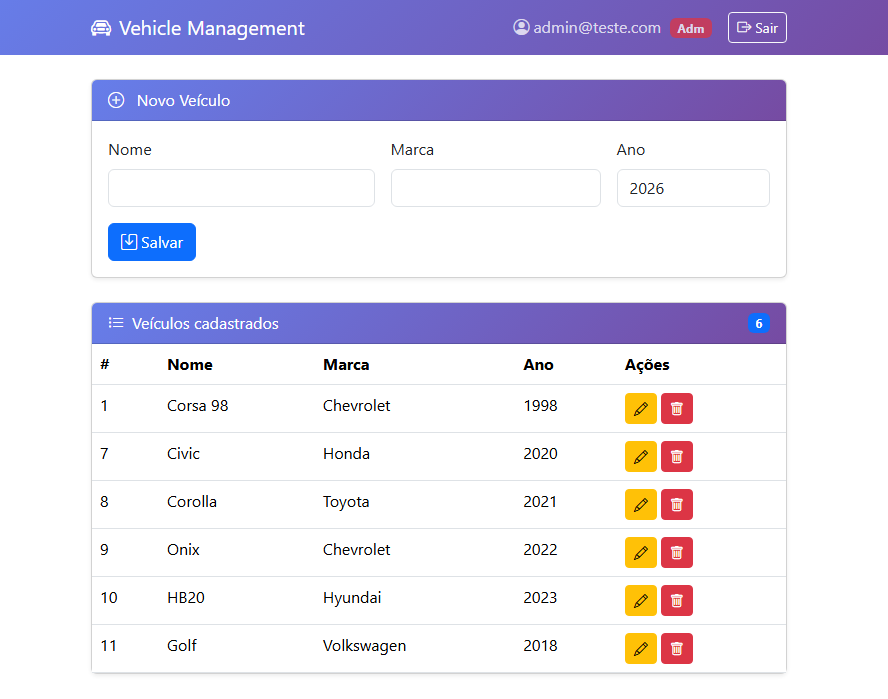
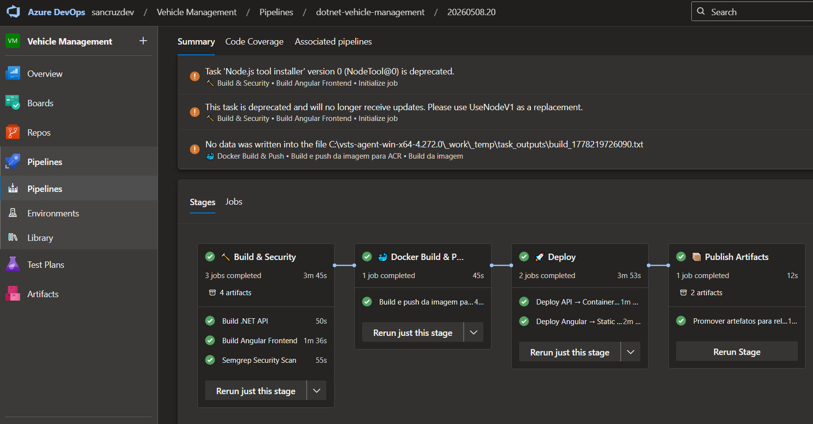
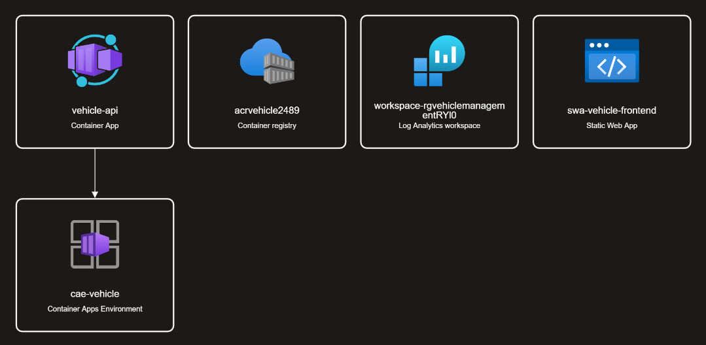
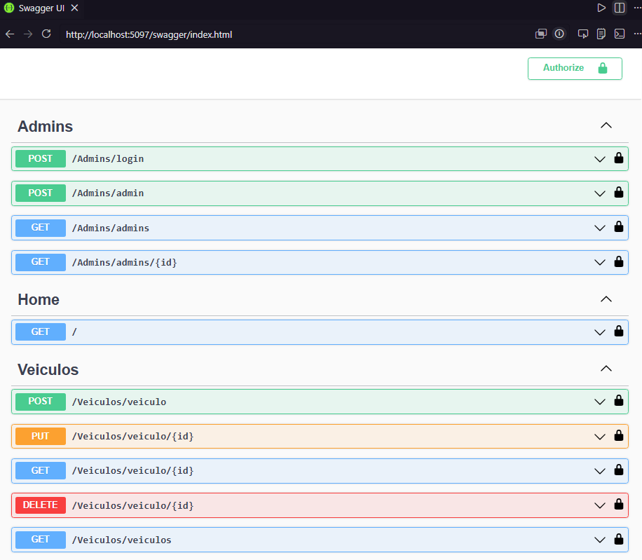
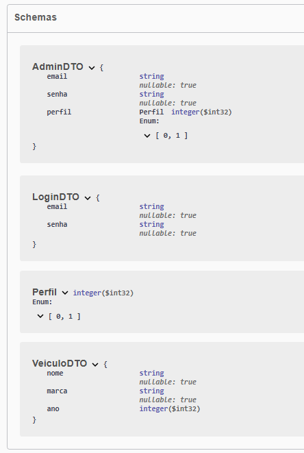

# dotnet-vehicle-management

[](https://dotnet.microsoft.com/)
[](https://angular.io/)
[](https://neon.tech/)
[](https://jwt.io/)
[](https://swagger.io/)
[](https://semgrep.dev/)
[](https://dev.azure.com/)
[](https://learn.microsoft.com/en-us/dotnet/core/testing/)

Sistema de gerenciamento de veículos desenvolvido como **projeto de portfólio e aprendizado**, cobrindo de forma prática os principais pilares de desenvolvimento de software moderno: API RESTful em .NET 8, frontend em Angular, banco de dados relacional, análise de segurança estática e pipeline de CI/CD com deploy automatizado na nuvem.

> **Nota sobre custos:** Por ser um projeto de estudo, as escolhas de infraestrutura foram feitas para manter o ecossistema funcional com o menor custo possível. O banco de dados utiliza o [Neon](https://neon.tech/) (PostgreSQL serverless com tier gratuito) e o pipeline de CI/CD utiliza um **agente local self-hosted** no Azure DevOps, evitando consumo de minutos de pipeline pagos. Os recursos Azure provisionados (Container Apps, Container Registry e Static Web Apps) foram escolhidos nos SKUs mais econômicos disponíveis.




---

## Visão Geral

A aplicação permite o gerenciamento de veículos com autenticação JWT, controle de acesso baseado em perfis (`Adm` / `Editor`) e CRUD completo. O objetivo principal é demonstrar, de forma integrada, as práticas necessárias na engenharia de software e computação em nuvem.


---

## Stack e Decisões Técnicas

### Backend — .NET 8 / ASP.NET Core
- Organizado seguindo princípios de **Clean Architecture** e **DDD**: separação clara entre `Domain`, `Infrastructure` e `Services`
- **Repository Pattern** via interfaces (`IAdminService`, `IVeiculoService`), desacoplando domínio da infraestrutura e facilitando testes com mocks
- **Dependency Injection** em toda a cadeia de dependências
- **Entity Framework Core 8** com Code First Migrations e PostgreSQL (Npgsql)
- **JWT stateless** com expiração configurável e autorização baseada em roles (`[Authorize(Roles = "Adm")]`)
- **BCrypt** para hash seguro de senhas — nunca armazenadas em texto puro
- **Middleware global de exceções** centralizado (`ExceptionMiddleware`), evitando try/catch espalhados pelos controllers
- Documentação interativa via **Swagger/OpenAPI**, com suporte a autenticação Bearer direto na UI

### Frontend — Angular 21
- SPA com módulos NgModule, roteamento protegido por **AuthGuard** e injeção automática de token via **HttpInterceptor**
- Redirecionamento automático para login em caso de token expirado (tratamento de 401)
- UI responsiva com **Bootstrap 5** e Bootstrap Icons

### Banco de Dados — PostgreSQL (Neon)
- Modelagem relacional com duas entidades: `Admins` e `Veiculos`
- Migrations gerenciadas pelo EF Core com seed de dados inicial
- Senhas hasheadas já na migration, nunca em plaintext

### Segurança — Semgrep
- Análise estática de vulnerabilidades integrada ao pipeline com regras **customizadas** (`.semgrep.yml`) e o ruleset oficial `p/csharp`
- **Quality Gate** configurado no pipeline: builds são bloqueados em caso de findings `HIGH` ou `CRITICAL`
- Regras customizadas cobrem uso inseguro de `ExecuteSqlRaw` (potencial SQL Injection) e `Console.WriteLine` em produção (risco de vazamento de dados)

### CI/CD — Azure DevOps + Docker

O pipeline (`azure-pipelines.yml`) roda em um **agente local self-hosted**, eliminando o custo de minutos de pipeline pagos. O build da imagem Docker também acontece localmente, com push direto para o **Azure Container Registry**. O pipeline cobre 4 estágios:

```
Build & Security  →  Docker Build & Push  →  Deploy  →  Publish Artifacts
```



1. **Build & Security:** compila a API e o frontend Angular, roda os testes MSTest e executa a análise Semgrep com quality gate
2. **Docker Build & Push:** constrói a imagem via Dockerfile multi-stage e faz push para o ACR
3. **Deploy:**
   - Backend → **Azure Container Apps**, atualizado via `az containerapp update` com a nova imagem
   - Frontend → **Azure Static Web Apps**, publicado via SWA CLI
4. **Publish Artifacts:** promove binários para artefatos de release

Segredos como connection string, JWT Key e deployment token são gerenciados pelo **Azure DevOps Library** (Variable Group), nunca expostos no código.

### Infraestrutura Azure




| Recurso | Tipo | Finalidade |
|---|---|---|
| `vehicle-api` | Container App | Hospedagem da API .NET |
| `acrvehicle****` | Container Registry | Armazenamento das imagens Docker |
| `cae-vehicle` | Container Apps Environment | Infraestrutura compartilhada dos containers |
| `swa-vehicle-frontend` | Static Web App | Hospedagem do frontend Angular |
| `workspace-*` | Log Analytics Workspace | Monitoramento e logs |

Toda a infraestrutura pode ser recriada com o script `setup-azure.sh`.

### Testes — MSTest
- **Testes unitários** de entidades (`AdminTest`)
- **Testes de integração** de serviços contra banco real (`AdminServiceTest`)
- **Testes de endpoints HTTP** com `WebApplicationFactory` e mocks de serviços (`AdminRequestTest`), cobrindo fluxos de login válido e inválido

---

## Estrutura do Projeto

```
dotnet-vehicle-management/
├── API/
│   ├── Domain/
│   │   ├── Controllers/       # AdminsController, VeiculosController, HomeController
│   │   ├── DTOs/              # Objetos de entrada (AdminDTO, LoginDTO, VeiculoDTO)
│   │   ├── Entities/          # Entidades Admin e Veiculo
│   │   ├── Interfaces/        # Contratos IAdminService, IVeiculoService
│   │   ├── ModelViews/        # Objetos de resposta
│   │   └── Services/          # Regras de negócio
│   ├── infrastructure/
│   │   ├── Auth/              # JwtSettings
│   │   ├── DB/                # MinimalApiContext (DbContext + seed)
│   │   └── ExceptionMiddleware.cs
│   ├── Migrations/
│   ├── Startup.cs             # Configuração de serviços e middlewares
│   └── Program.cs
├── frontend/
│   └── src/app/
│       ├── core/              # AuthGuard, AuthInterceptor
│       ├── models/            # Interfaces TypeScript
│       ├── pages/             # Login, Veiculos
│       └── services/          # AuthService, VeiculoService
├── Test/
│   ├── Domain/                # Testes unitários e de integração
│   ├── Helpers/               # WebApplicationFactory setup
│   ├── Mocks/                 # AdminServiceMock
│   └── Requests/              # Testes de endpoints HTTP
├── Dockerfile                 # Multi-stage build (SDK → ASP.NET runtime)
├── azure-pipelines.yml        # Pipeline CI/CD completo (4 estágios)
├── setup-azure.sh             # Script de provisionamento da infraestrutura Azure
└── .semgrep.yml               # Regras customizadas de análise de segurança
```

---

## Como Rodar Localmente

### Pré-requisitos
- .NET 8 SDK
- Node.js 20+ e Angular CLI (`npm install -g @angular/cli`)
- PostgreSQL 15+ (local ou conta [Neon](https://neon.tech/))

### Backend

```bash
# Configure a connection string em API/appsettings.json
cd API
dotnet ef database update
dotnet run
# Swagger: http://localhost:5097/swagger
```

### Frontend

```bash
cd frontend
npm install
ng serve
# Acesse: http://localhost:4200
```

### Credenciais padrão

| Campo | Valor |
|---|---|
| Email | `admin@teste.com` |
| Senha | `123456` |

---

## Endpoints e Schemas da API

| Método | Rota | Descrição | Auth |
|---|---|---|---|
| POST | `/Admins/login` | Login e geração de token JWT | Público |
| GET | `/Admins/admins` | Lista administradores | Adm |
| GET | `/Admins/admins/{id}` | Busca administrador por ID | Adm |
| POST | `/Admins/admin` | Cadastra administrador | Adm |
| GET | `/Veiculos/veiculos` | Lista veículos (paginado) | JWT |
| GET | `/Veiculos/veiculo/{id}` | Busca veículo por ID | JWT |
| POST | `/Veiculos/veiculo` | Cadastra veículo | JWT |
| PUT | `/Veiculos/veiculo/{id}` | Atualiza veículo | Adm |
| DELETE | `/Veiculos/veiculo/{id}` | Remove veículo | Adm |





---

## Análise de Segurança

```bash
pip install semgrep

# Linux/Mac
./semgrep-scan.sh

# Windows
.\semgrep-scan.ps1
```

Dois relatórios JSON são gerados: `semgrep-custom-report.json` (regras do projeto) e `semgrep-full-report.json` (ruleset oficial `p/csharp`).

---

## Testes

```bash
cd Test
dotnet test
```